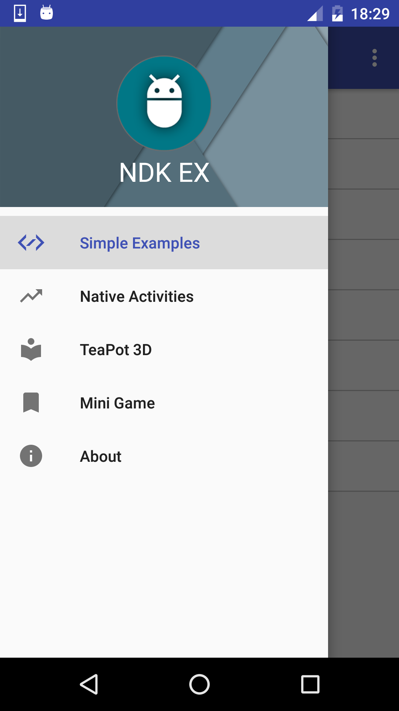
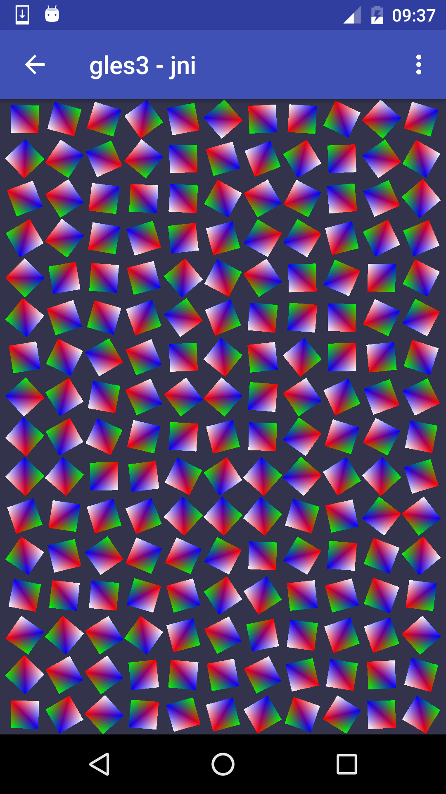
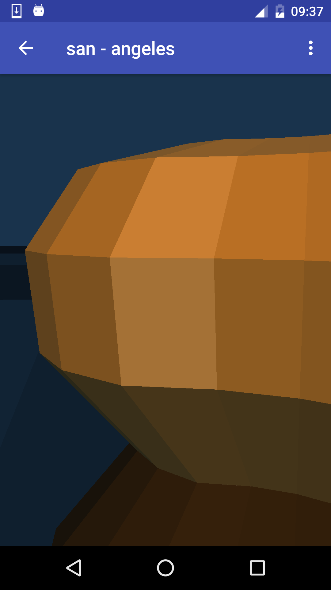
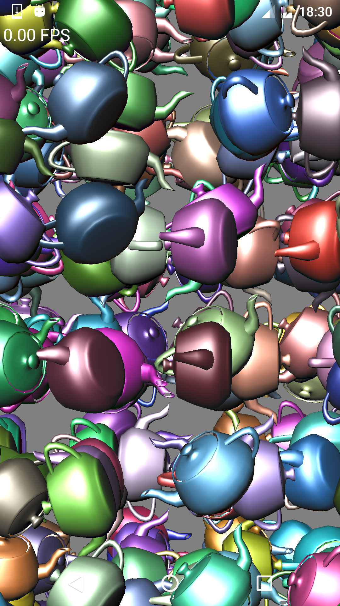

### Developer
- Nguyen Xuan Duong
**Email**
- duongnguyenxuan10m@gmail.com
**LinkIn**
- [[View Profile]][LinKInProfile]
[LinKInProfile]: https://www.linkedin.com/in/duong-nx-5b2131131

### Android NDK-Examples
NDK-Examples client for android

[![Get it on Google Play][Play Store Badge]][Play Store]
[Play Store Badge]: https://play.google.com/intl/en_us/badges/images/badge_new.png
[Play Store]: https://play.google.com/store/apps/details?id=com.duongnx.ndk.examples

### Screenshots

### Setup
**Requirements**
- JDK 8
- Android Studio 2.2
- Latest Android SDK tools
- Latest Android platform tools
- Android SDK Build tools 25
- Android SDK 25
- Latest Android NDK
- Android Support Library 25.0.0 (appcompat-v7, recyclerview-v7, design...)

### License
    Copyright 2016 Nguyen Xuan Duong(duongnx)
    
    Licensed under the Apache License, Version 2.0 (the "License");
    you may not use this file except in compliance with the License.
    You may obtain a copy of the License at
    
        http://www.apache.org/licenses/LICENSE-2.0
    
    Unless required by applicable law or agreed to in writing, software
    distributed under the License is distributed on an "AS IS" BASIS,
    WITHOUT WARRANTIES OR CONDITIONS OF ANY KIND, either express or implied.
    See the License for the specific language governing permissions and
    limitations under the License.
    
